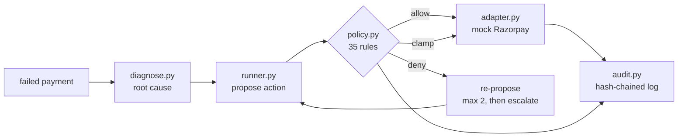

<h1>Payment Failure Recovery Agent</h1>

**An agent that recovers failed payments inside a written policy it cannot override.**

Razorpay AI Revenue Recovery track · Merchant: "Kettle & Co", D2C ecommerce, India


---

## Run it

```bash
git clone https://github.com/swostideep/recovery-agent && cd recovery-agent
python3 src/runner.py                              # three arms, ~15s
python3 src/report.py                              # results.json + dashboard.html
python3 -m unittest discover -s tests -t tests     # 80 tests, ~5s
open dashboard.html
```

**No install step.** No pip, no API key, no network, no Docker. Everything runs
on the Python 3.9+ standard library and reproduces exactly from `seed=42`.

---

## The result

200 failed payments worth **Rs 703,533**. Three arms, identical seeded batch,
identical outcome oracle.

| | do_nothing | naive_retry | **agent** |
|---|---|---|---|
| Recovered | Rs 0 | **Rs 255,494** | Rs 144,196 |
| Recovery rate | 0% | **36.32%** | 20.50% |
| Attempts spent | 0 | 491 | **271** |
| Actions in customer quiet hours | 0 | 248 | **0** |
| Attempts on payments that can never succeed | 0 | 150 | **16** |
| Policy checks logged | 0 | 0 | **1,540** |
| Payments handed to a human | 0 | 0 | **51** |

**The agent recovers less gross revenue than an unconstrained retry loop, and
that is the measurement, not a defect.**

Naive retry earns its higher number by acting 248 times inside customer quiet
hours, retrying 33 risk declines, and retrying 84 dead cards. A merchant who
retries a risk decline damages their issuer relationship regardless of what it
recovers. This project measures the cost of the constraint instead of hiding it.

---

## How it works



The agent **proposes**; the policy engine **decides**. The engine returns exactly
one of `allow` / `deny` / `clamp` and may never substitute the action type.

| File | Role |
|---|---|
| `policy.md` | The policy, in prose. Every rule has an ID. |
| `src/policy.py` | Those rules as code. `grep G4` finds one function. |
| `src/diagnose.py` | Root-cause classification. Rules-only by default. |
| `src/simulator.py` | Seeded batch, issuer-health signal, outcome oracle. |
| `src/adapter.py` | Mock Razorpay rail + circuit breaker. |
| `src/runner.py` | The loop, three arms, all database writes. |
| `src/audit.py` | Append-only hash-chained log, `verify_integrity()`. |
| `schema.sql` | 7 tables, 2 views, tamper triggers. |
| `tests/` | 80 tests. Every claim below is one of them. |

---

## Bounded

Limits are absolute and enforced in code, not prompts. The engine denied
**49 proposed actions**:

| Rule | Denied | What it stopped |
|---|---|---|
| `B2` | 15 | a second nudge to the same customer inside 24h |
| `B4` | 12 | a retry more than 72h after failure |
| `G7` | 11 | a third immediate retry on a transient failure |
| `B5` | 8 | auto-executing above Rs 25,000 |
| `S5` | 3 | messaging a customer who opted out |

`B6` caps actions per run. The agent halts *itself* mid-run:

```bash
python3 src/runner.py n=20 b6=10 db=data/b6_demo.db
#   agent           10 actions      ← stops dead, 19 payments dead-lettered
```

## Gated

Bounds beat heuristics, always (`P1`). A real row from `policy_checks`:

```
G5  earliest permitted    2026-02-01T10:00:00+05:30   (salary-cycle heuristic)
P2  G5 proposed 2026-02-01T10:00, outside the B4 ceiling 2026-01-29T07:26;
    clamped to 2026-01-26T13:26
```

Rules are never short-circuited: one payment logged three independent denials
(`B1` exhausted, `B5` over Rs 25,000, `G2` risk decline) rather than stopping at
the first — `v_blocked_actions` is only honest if every rule that would have
blocked is counted.

## Audit Trail

**450 events · 411 decisions · 1,540 policy checks**, each naming its rule ID,
result and reason. The log is append-only, enforced by SQL triggers:

```bash
$ sqlite3 data/recovery.db "UPDATE audit_log SET ts='hacked';"
Error: audit_log is append-only: UPDATE forbidden (19)
```

The triggers block `UPDATE` and `DELETE` but **allow `INSERT`** — so the real
attack is a forged row appended to the log, and the hash chain is what catches
that:

```
DETECTED: seq 4: chain broken, prev_hash deadbeef... does not match previous row
DETECTED: seq 4: row_hash mismatch, stored fakehash... (row was altered)
```

*Triggers stop the clumsy attack; the hash chain stops the clever one.*
`verify_integrity()` re-walks the chain and re-checks for orphans after every run.

## Measured Recovery

See [the result](#the-result). The efficiency picture:

| | naive_retry | agent |
|---|---|---|
| Rupees recovered per attempt | Rs 520 | **Rs 532** |
| Attempts on unrecoverable payments | 189 | **79** |
| Forbidden attempts (G1/G2/G3) | 150 | **16** |

Every one of the agent's 16 remaining forbidden attempts traces to a
**misdiagnosis**, not a policy failure: the engine can only gate on what
diagnosis told it.

## Exceptions We Could Not Resolve

51 payments, **Rs 285,437**, handed to a human rather than guessed at:

| Reason | Payments | Value |
|---|---|---|
| `NEEDS_HUMAN_APPROVAL` | 20 | Rs 172,319 |
| `RISK_DECLINE` | 18 | Rs 50,239 |
| `UNKNOWN_ERROR_CODE` | 13 | Rs 62,879 |

Plus 61 `exhausted` (B1 cap), 24 `unrecoverable` (dead instrument), 12 `expired`
(B4 ran out). All 200 payments reach a terminal state — a test asserts it.

## Failure Handled Gracefully

**Circuit breaker (`C1`–`C3`).** Three consecutive 5xx trips it; every later call
raises `CircuitOpenError` across *all* adapter methods; it reopens only via
`reset()`. Clearing the fault does not self-heal it. In-flight payments move to
the dead-letter queue as `ADAPTER_UNAVAILABLE` — no silent retries.

**Missing LLM (`C4`).** `anthropic` is imported *inside* the function, never at
module level, so the module loads with no SDK present. With `use_llm=True` and no
key: `source=fallback`, the rules answer stands, no exception escapes, and no
money decision changes.

**Missing health signal (`G4`).** Two issuer/method pairs deliberately have no
snapshot. They fall back to a fixed 90-minute delay, logged as
`reason=no_health_signal`.

## Limitations & Methodology

**The simulator is not reality.** Ground truth lives in `latent_json`, which the
agent structurally cannot read: `diagnose.visible()` rebuilds each payment from an
11-field allowlist. Two tests assert the leak is impossible. But the recovery
numbers are only as good as the oracle's assumptions.

**Rules-only diagnosis is 80% accurate, deliberately.** The simulator emits a
misleading `error_code` for 35 of 200 payments (17%) — rules cannot see through
those. The issuer-health signal lifts accuracy from 76% to 80% by reinterpreting
ambiguous gateway errors, while introducing 4 new errors where a genuine blip
coincided with a downtime window. Net +8: a trade, not a pure win.

**`P2`'s clamp direction was wrong in v1.2, and fixing it cost something.**

| P2 direction | Recovered | Rate | Expired | Per attempt |
|---|---|---|---|---|
| latest (v1.2) | Rs 134,922 | 19.18% | 49 | Rs 668 |
| earliest (v1.3) | **Rs 144,196** | **20.50%** | **12** | Rs 532 |

v1.2 clamped retries to the 72h edge, after customer intent had decayed, with no
room for a second attempt. v1.3 clamps to the earliest feasible moment instead —
recovering Rs 9,274 more and rescuing 37 payments from expiry, at the cost of 69
extra attempts, which nearly erases the per-attempt margin over naive retry.

**The LLM has never made a real API call.** Its *handling* is tested — five tests
inject a stand-in SDK and assert that a valid response is used and that malformed
JSON, an out-of-set class, an API exception, and a missing key each fall back to
rules. What is unverified is whether a real model beats rules on the ambiguous
payments. `src/llm_eval.py` measures exactly that:

```bash
echo 'ANTHROPIC_API_KEY=sk-ant-...' >> .env
python3 src/llm_eval.py     # ~60 calls, writes llm_eval.json
```

Submitted metrics are unaffected — they are rules-only and reproduce with no key.

**The audit log is single-writer.** `append_event` takes `seq` as `MAX(seq)+1`
inside `BEGIN IMMEDIATE` because the hash covers `seq`, so it cannot be written
from two processes concurrently.

**Not implemented:** real nudge delivery (generated and logged only), live
Razorpay integration (mocked behind real method signatures), mandate rules beyond
amount and spacing.

---

**[`DEMO.md`](DEMO.md)** — a four-minute run-sheet, every command verified.
**[`policy.md`](policy.md)** — the policy itself, 35 rules.
